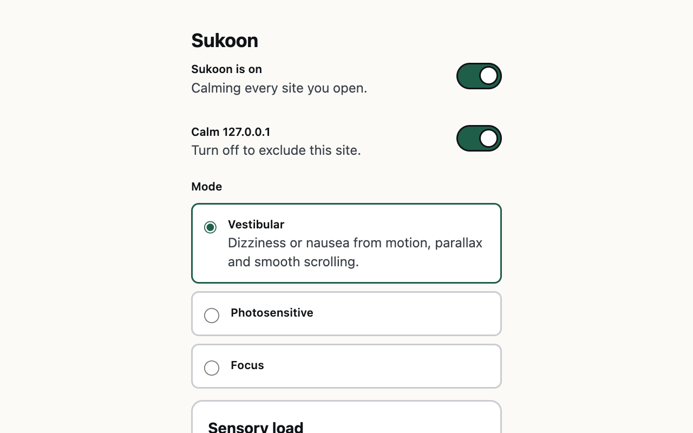
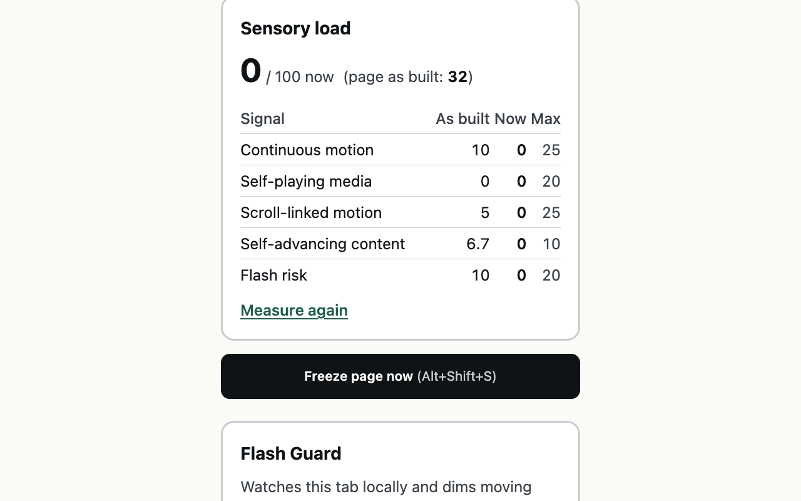
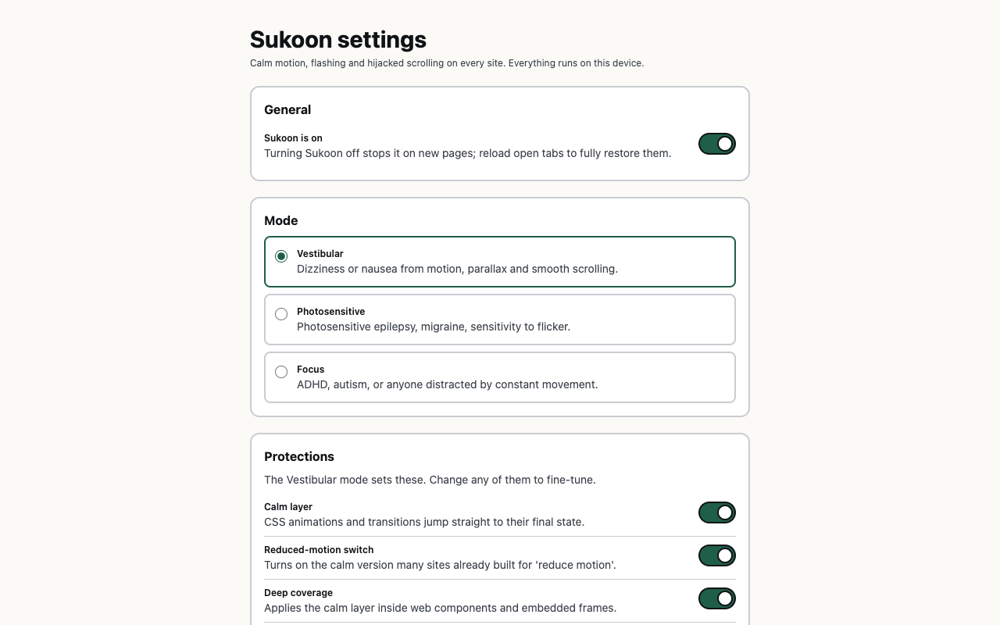
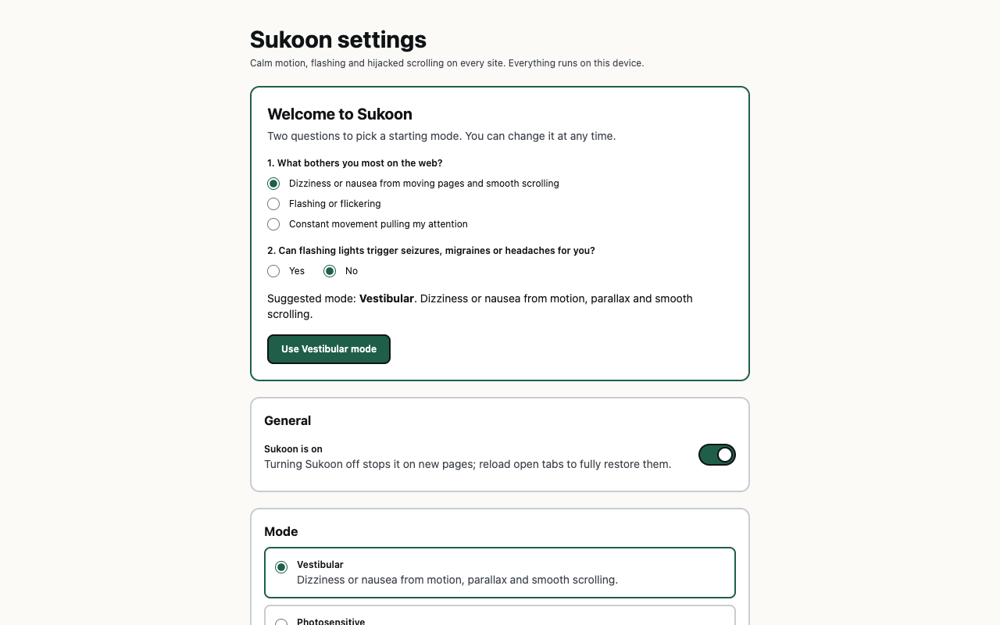
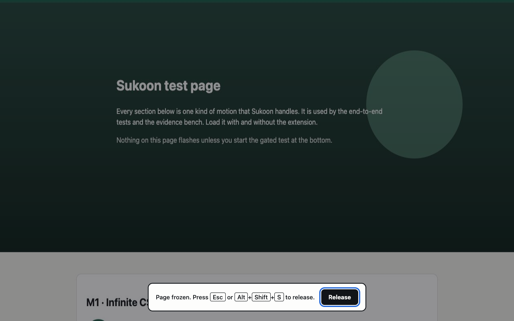

# Sukoon — Calm the Web

[](https://github.com/AttSee/sukoon/actions/workflows/ci.yml)
[](LICENSE)

Sukoon is an open-source browser extension that calms motion, flashing and hijacked scrolling on any website. It runs
entirely on your device, and every number it claims can be reproduced with one command.

> **Not a medical device.** Sukoon reduces exposure to common motion and flash triggers. It cannot guarantee
> protection from seizures, migraines, dizziness or any other symptom.

## Who it is for

| Group | Why motion matters |
| --- | --- |
| **Vestibular disorders** | Around 35% of US adults over 40 show some vestibular dysfunction (Agrawal et al., *Arch Intern Med*, 2009). WCAG notes that motion on scroll and parallax can trigger dizziness, nausea and headaches that may need bed rest to recover from. |
| **Photosensitivity** | Photosensitive epilepsy affects roughly 1 in 4,000 people, or 3–5% of people with epilepsy; flicker also triggers migraine. |
| **ADHD, autism, focus** | Constant movement pulls attention away from the content. |

## What makes it different

Other tools already stop animations; Motion Guard, for example, freezes CSS/JS motion, parallax and sliders. Sukoon
differs in four ways that no single free tool combines:

1. **Fully free and open**, including parallax freezing and automatic calming on every site.
2. **Flash Guard** that works on any page (not only YouTube), analysed locally with no server.
3. **Evidence from neutral tools** (EA's IRIS and frame-difference motion energy) instead of a score of its own.
4. **An interface that does what it asks of the web**: no motion, high contrast, keyboard and screen-reader friendly.

## Principles

- No medical claims anywhere. Sukoon *reduces exposure*; it does not *protect from seizures*.
- No servers, no analytics. The only network access re-reads stylesheets the page already loaded (no cookies).
- **Finish, don't cancel.** Motion jumps to its end state instead of being removed, so content that animates in is
  never left hidden.
- Every number in the pitch comes from a script in this repository.

## Screenshots

| Popup | Sensory Load Index |
| --- | --- |
|  |  |

| Settings | Welcome screen |
| --- | --- |
|  |  |

| Panic freeze |
| --- |
|  |

Regenerate them from the built extension with `npm run screenshots` (1280×800, the store format). The listing copy
and permission justifications for both stores are in [`docs/store-listing.md`](docs/store-listing.md).

## Install (development build)

Requirements: Node 24+, npm. TypeScript is 7.0 (the native compiler).

```bash
npm install
npm run build            # Chrome / Edge → .output/chrome-mv3
npm run build:firefox    # Firefox 140+ → .output/firefox-mv3
npm run zip              # store-ready zips for both, plus the Firefox source archive
```

Chrome: open `chrome://extensions`, enable Developer mode, **Load unpacked**, pick `.output/chrome-mv3`.
Firefox: open `about:debugging#/runtime/this-firefox`, **Load Temporary Add-on**, pick `.output/firefox-mv3/manifest.json`,
then open Sukoon's settings and press **Allow on all sites** (Firefox makes host access opt-in).

The test page used by every check: `npm run test-page`, then open <http://127.0.0.1:4173/>.

## Architecture

```
Background SW ── settings · dynamic script registration · native image policy
   │             keyboard command · panic screenshot · tabCapture stream id
   ├── calm.css ............ registered CSS, injected at document_start (before first paint)
   ├── main-world.js ....... MAIN world: matchMedia · attachShadow · play() · scrollTo · wheel · rAF
   ├── calm.js ............. isolated world: CSSOM rewrite · DOM adapters · parallax · SLI · panic UI
   │        (MAIN ⇄ isolated via CustomEvent, JSON payloads)
   ├── offscreen.html ...... Flash Guard analyser (Chrome only)
   └── popup / options ..... React 19 + Tailwind CSS 4

Evidence bench (outside the extension): Playwright + IRIS + NumPy
```

Content scripts are registered at runtime with `scripting.registerContentScripts`, not in the manifest. Excluding a site
is just an `excludeMatches` update, and injection still happens before the page's first paint.

`calm.css` is generated at build time from [`src/shared/calm-css.ts`](src/shared/calm-css.ts), the same source that
produces the stylesheet adopted by shadow roots, so the two can never drift apart.

### Project layout

```
src/
  shared/        pure logic, unit-tested: settings, media-query rewrite, calm CSS, SLI, flash detector
  content/       isolated-world modules: CSSOM rewriter, DOM adapters, parallax freezer, SLI observer, freeze UI
  entrypoints/   background, main-world, calm (isolated), offscreen, popup, options
  ui/            React components, hooks, copy, Tailwind theme
test-page/       the page every module is tested against
tests/           Vitest unit tests
e2e/             Playwright tests against the built extension
bench/           evidence bench (record → analyse → report)
```

## The ten modules

| # | Module | How |
| --- | --- | --- |
| 1 | **Calm layer** | Registered CSS at `document_start`: animation and transition durations of 0.01 ms, one iteration, `animation-timeline: auto` (scroll-driven motion becomes time-based and ends instantly), no smooth scrolling, no fixed backgrounds, and View Transitions switched off. Scoped by an attribute on `<html>`, so it can be paused instantly. |
| 2 | **Reduced-motion switch** | Many sites already ship a calm version behind `prefers-reduced-motion` that nobody sees. Sukoon cannot change the query's value, but it rewrites the query itself: `reduce` becomes an always-true condition and `no-preference` an always-false one, in CSSOM rules (recursing into `@supports`, `@layer`, `@container`, `@import`), `<link media>`, `<source media>` and `window.matchMedia`. Cross-origin stylesheets are re-read by the background, and only their reduced-motion rules are extracted and adopted with the right base URL. Libraries that ask `matchMedia` before animating switch themselves off. |
| 3 | **Deep coverage** | `attachShadow` is patched in the MAIN world so every shadow root adopts the calm sheet; the `adoptedStyleSheets` setter keeps it attached when frameworks such as Lit replace the list. Declarative shadow DOM is swept after parsing. All frames, including `about:blank`, `srcdoc` and `blob:` frames, are covered. |
| 4 | **Library adapters** | `document.getAnimations()`: finite Web Animations finish, infinite ones return to their first frame and pause. SVG SMIL (`pauseAnimations`), `<marquee>`, AOS/WOW/SAL reveal classes, GSAP (finite tweens finish, loops park, ScrollTrigger settles), Lottie, Swiper, Slick, Owl and Flickity autoplay. The adapters sit on top of the generic protection; if a library changes, protection does not collapse. |
| 5 | **Scroll guard** | (a) CSS: no smooth scrolling or fixed backgrounds. (b) `scrollTo`, `scrollBy` and `scrollIntoView` become instant. (c) A wheel listener registered first on `window` (capture phase, at `document_start`) engages only when a smooth-scroll hijacker is present and the page scrolls natively, and then calls `stopImmediatePropagation()` so the device's own scrolling returns. Detection runs at the start of every wheel burst and never latches: Lenis is detected by its `lenis` class; any other page-wide hijacker by cancelling a synthetic zero-delta wheel event dispatched on `<body>`, which a map, chart or slider listening on its own element never sees. Virtual scrollers (`overflow: hidden`) are left alone, or the page would freeze. (d) Vestibular mode: layers whose inline transform value changes three times within 400 ms of one scroll burst (scroll-synced writes, not a 4 Hz progress bar) are pinned with a stylesheet rule that beats the library's next inline write. DOM observation only runs while scrolling. |
| 6 | **Media guard** | Animated images use the browser's own switch: `accessibilityFeatures.animationPolicy` in Chrome, `browserSettings.imageAnimationBehavior` in Firefox (browser-wide, not per site). `HTMLMediaElement.play()` rejects with `NotAllowedError`, exactly like the browser's own autoplay block, unless `navigator.userActivation.isActive`; the `autoplay` attribute is stripped while the page is parsed; a capture-phase `play` listener catches anything else. Audio is not affected. |
| 7 | **Panic freeze** | `Alt+Shift+S` (or the popup button): the background takes a screenshot of the tab, which covers the page, dimmed, from a closed shadow root; scrolling locks; media, animations and SMIL pause; `requestAnimationFrame` callbacks are held in the MAIN world, which also stops canvas and WebGL. The same shortcut, Esc or the Release button undoes it. The top frame owns the state and every embedded frame follows it, so Esc releases the embeds too. The screenshot is decoded locally into a canvas, so page CSP never blocks it. |
| 8 | **Sensory Load Index** | A guide with published weights (below). The popup shows the page *as built* next to the page *now*, with the full breakdown. "As built" is measured by lifting the calm layer for a single synchronous task, so nothing is painted in between. |
| 9 | **Flash Guard** (Chrome, on request) | `tabCapture` stream → offscreen document → frames downsampled to 64×36 → WCAG flash detector (below). On a hit, video, canvas, images and frames are dimmed, media and animation stop, and the dim stays until the user restores it (restoring automatically would oscillate, because the dim itself lowers the flashes it measures). Restore reaches every frame of the tab. |
| 10 | **Evidence bench** | See [Evidence](#evidence). |

## Modes

| Mode | For | Turns on |
| --- | --- | --- |
| **Vestibular** | Dizziness and motion sickness | 1, 2, 3, 4, 5 with parallax freeze, 6 |
| **Photosensitive** | Photosensitive epilepsy, migraine | 1, 2, 3, 6, softer video contrast; Flash Guard on request |
| **Focus** | ADHD, autism | 1, 2, 3, 4, 6 |

Every protection can be switched individually in the settings. The two-question welcome screen suggests a mode, and
suggests Vestibular straight away when the operating system already asks for reduced motion.

## Sensory Load Index

Each signal is scored from 0 to 1, then multiplied by its weight. Code: [`src/shared/sli.ts`](src/shared/sli.ts).

| Signal | Measured as | Weight |
| --- | --- | ---: |
| Continuous motion | Infinite animations on visible elements (`getAnimations()`), by area: a quarter of the viewport saturates | 25 |
| Self-playing media | Videos that started without a gesture, plus visible animated images | 20 |
| Scroll-linked motion | Wheel hijack (0.5) + parallax layers (0.15 each) + scroll-driven animations (0.1 each) | 25 |
| Self-advancing content | Autoplaying sliders, `<marquee>`, SMIL documents (a third each) | 10 |
| Flash risk | Looping animations faster than 3 Hz that change opacity, colour or filter (0.5 each), or a Flash Guard hit (1) | 20 |

The index earns trust only if it tracks motion measured independently. The bench reports the Spearman correlation
between the index and measured motion energy across all sites.

## Flash Guard algorithm

Following the WCAG 2.x definitions ([`src/shared/flash.ts`](src/shared/flash.ts)):

- **General flash**: a pair of opposing changes in relative luminance of 10% or more, where the darker state is below 0.80.
- **Red flash**: a pair of opposing transitions involving saturated red (R / (R+G+B) ≥ 0.8) where (R − G − B) × 320 changes by more than 20.
- **Safe** when there are no more than three flashes (six transitions) in any one second, **or** the concurrently
  flashing area stays under 25% of any 10° visual field. At 1024×768 that field is about 341×256 px, so the limit is
  0.25 × 341 × 256 / (1024 × 768) ≈ **2.78% of the screen**.

The frame is split into a 16×9 grid. Each cell tracks its own luminance and red transitions in a sliding one-second
window; when cells over the limit cover 2.78% of the frame or more, the tab is dimmed.

**Honest limits:** the guard has to see flashes before it can count them, so it shortens exposure and cannot prevent
the first second. Chrome shows a capture indicator while it runs. Firefox has no equivalent API, so Flash Guard is
Chrome-only.

## Permissions

| Permission | Why | Browser |
| --- | --- | --- |
| `storage` | Settings and excluded sites | All |
| `scripting` + `<all_urls>` | Register the calm scripts so they run before first paint on every site | All |
| `accessibilityFeatures.read` / `.modify` | The browser's own switch for animated images | Chrome |
| `browserSettings` | The same, in Firefox | Firefox |
| `activeTab` | The panic screenshot | All |
| `tabCapture` + `offscreen` | Flash Guard, only when you start it | Chrome |

## Alternatives considered and rejected

- **`chrome.debugger` with `Emulation.setEmulatedMedia`.** In theory the most complete way to emulate reduced motion.
  But the `debugger` permission cannot be optional, and Chrome shows a yellow "being debugged" bar on the tab: a
  frightening experience for someone who is already sensitive.
- **Repeated `captureVisibleTab` for flash detection.** Captures per second are rate-limited; exceeding the quota
  throws, and developers need about 400 ms between captures. That is far too slow to count three flashes a second.
- **Reading video pixels through a canvas in the page.** Cross-origin video taints the canvas and blocks pixel reads.
  `tabCapture` sees what the user sees, without that restriction.

## Evidence

The bench records every site twice, without and with Sukoon (Vestibular mode), under an identical 15-second script at
1280×720 in Playwright's bundled Chromium (branded Chrome and Edge no longer load unpacked extensions from the command
line): 4 s still, scripted wheel scrolling, 3 s still.

```bash
python3 -m venv bench/.venv && bench/.venv/bin/pip install -r bench/requirements.txt   # once
npx playwright install chromium                                                         # once
npm run build && npm run bench
```

| Measure | Tool |
| --- | --- |
| **Idle motion**: mean frame-to-frame luminance change at 160×90 while nobody touches the page (per-pixel changes under 4/255 are codec noise) | Playwright + NumPy |
| Motion while scrolling (context only: native scrolling can travel further than a hijacked one) | Playwright + NumPy |
| General and red flash failures | [IRIS](https://github.com/electronicarts/IRIS) (Python port [`iris-pse-detection`](https://pypi.org/project/iris-pse-detection/)) |
| DOMContentLoaded and LCP cost (medians) | Performance API via Playwright |
| Breakage rate | Manual checklist, [`bench/breakage-checklist.md`](bench/breakage-checklist.md) → `bench/breakage.csv` |

The report is written to [`bench/results/report.md`](bench/results/report.md). Publish it as it comes out, including
the bad numbers: an honestly reported breakage rate earns more trust than a claim of perfection.

`npm run bench:breakage` fills the breakage row automatically (see
[`bench/breakage-checklist.md`](bench/breakage-checklist.md) for the rules and their limits); a manual pass on top is
still worth doing before a release.

IRIS judges the change in whole-frame average luminance with a 25%-of-frame area rule, so it only fails large flashes.
Sukoon's Flash Guard uses the stricter 10° visual-field limit. IRIS describes its own output as informational only; it
is not a certification.

## Tests

```bash
npm run typecheck    # TypeScript 7
npm test             # Vitest: media-query rewrite, SLI, flash detector, settings, calm CSS
npm run check        # typecheck + unit tests + both builds, in one go (what CI runs first)
npm run test:e2e     # Playwright: the built extension against the test page, plus axe-core on the popup and settings
```

The same steps run on every push and pull request through [GitHub Actions](.github/workflows/ci.yml); on the default
branch the workflow also uploads the store-ready zips as build artifacts.

For debugging, the popup can be opened as a normal tab and pointed at another tab: `popup.html?tab=<tabId>`.

See [CONTRIBUTING.md](CONTRIBUTING.md) for the development loop and how to report a broken site, and
[CHANGELOG.md](CHANGELOG.md) for what changed in each release.

The end-to-end suite checks each module's acceptance criterion: CSS loops finish and an excluded site is left alone;
the site's own reduced-motion version turns on (CSS, cross-origin CSS, `<link media>`, `<picture>`, `matchMedia`) and
survives the switch being turned off and on; shadow roots and frames are calmed; WAAPI, SMIL and reveal-on-scroll
settle while a paused GSAP timeline is left alone; wheel hijack is bypassed (with and without the Lenis class), a
wheel-zoom widget keeps working, smooth scroll is instant and parallax is frozen; autoplay stops while a real click
still plays; the native image policy is set; panic freezes and Esc releases, embedded frames included; the SLI drops;
a Flash Guard hit dims content in every frame until restored; and axe-core finds no serious or critical issues in the
popup or settings page.

`e2e/flash-guard.spec.ts` runs Flash Guard live: real tab capture, the offscreen analyser, and the dimming response to
the test page's gated flash test. Tab capture normally needs a click on the toolbar, which automation cannot give, so
this test uses Chromium's `--allowlisted-extension-id` testing switch.

## Known trade-offs

- **Loading spinners stop.** They finish like every other loop. Exclude the site with one click if that matters.
- **The animated-image policy is browser-wide**, because that is how the browsers expose it.
- **Autoplay within about 5 seconds of a click is allowed**, because the browser still counts it as a user gesture.
- **Sites that move content horizontally with scroll** (scroll-jacked galleries) may lose that content when parallax is
  frozen. Exclude the site, or turn off Parallax freeze in the settings.
- **The calm layer gives every element a 0.01 ms transition**, so `transitionend` handlers still fire. That keeps sites
  working, at the cost of creating very short transitions.
- **Pages loaded before installation** need a reload. The panic freeze injects itself on demand anyway.
- **Smooth-scroll hijackers that listen on a wrapper element** (not `window`, `document` or `<body>`) and do not
  carry the `lenis` class are not detected, and hijackers that only cancel non-zero wheel deltas are not either.
  Those pages keep their own scrolling; nothing else changes.
- **A paused GSAP timeline** (a menu waiting for a click) is left alone, so it still animates when opened; finishing
  it in advance would open the menu at page load.

## Privacy

Sukoon has no servers, analytics or telemetry. Settings live in `storage.local`. The only network requests re-read
stylesheets that the page has already loaded, without cookies, and only responses served as `text/css` are used.
Flash Guard frames never leave the offscreen document.

## License

[MIT](LICENSE)
